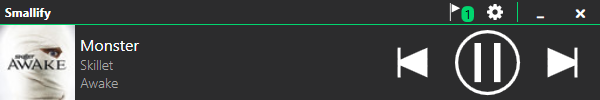

---

# Smallify

This is a WPF application using `Prism` & `Unity`, intended to provide a Spotify mini-player for Windows.

## Usage

Smallify requires an `Access Token`, this can be set/updated in the `Settings` menu.

To generate an access token, navigate to the [project website](https://smallify.nicksmirnoff.co.uk), and connect to a Spotify account.

## Notes

- Spotify Premium is required for media controls
- Smallify is **NOT** a standalone Spotify device, users will need to have an official Spotify device/application on standby
- Smallify uses [Implicit grant flow](https://developer.spotify.com/documentation/general/guides/authorization-guide/#implicit-grant-flow) for authentication, through the [project website](https://smallify.nicksmirnoff.co.uk)
  - Users are directed to `Spotify Accounts Service` with a request for the following permission scopes:
    - `user-modify-playback-state`
    - `user-read-playback-state` 
    - `user-read-currently-playing`
  - Granted access generates an `access_token`, which lasts 1 hour

## Screenshots

## Related Projects

- ['Spofy' by eltoncezar](https://github.com/eltoncezar/Spofy)
