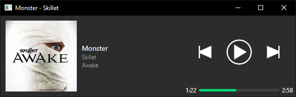
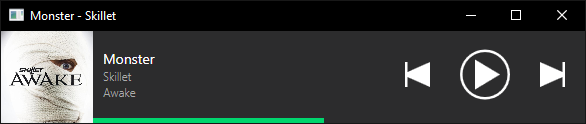

***
## smallify
This is a WPF application using `Prism` & `Unity`, intended to provide a mini Spotify player for Windows. I find that Spotify takes up a lot of window space and is often unnecessary for me to have access to anything but the basic controls and track information.

Since [maximilian-krauss's "Winfy"](https://github.com/maximilian-krauss/Winfy) and [Eltoncezar's "Spofy"](https://github.com/eltoncezar/Spofy) do not function on my device(s), I decided to make my own as a personal project, this is not intended to compete with, nor succeed their work.

## How it works
This application uses [SpotifyAPI-NET](https://github.com/JohnnyCrazy/SpotifyAPI-NET) for Spotify interaction and [Squirrel.Windows](https://github.com/Squirrel/Squirrel.Windows) for installation and updating.

## Notes
- This is **NOT** a replacement for Spotify and will require Spotify to be running

## Install
- [GitHub Latest Release](https://github.com/hypzeh/smallify/releases/latest)

## Screenshots

